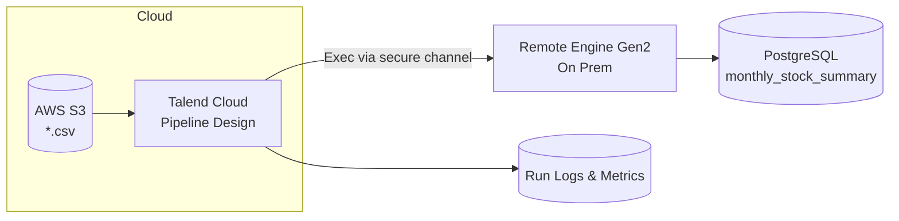

## 🚀 S3 → Talend Cloud → PostgreSQL Monthly Stock Aggregation

Production‑style ETL pipeline that ingests daily OHLC+Volume equity CSV files (AAPL, AMZN, GOOGL, MSFT) from Amazon S3, enriches them, performs monthly aggregations, and loads a curated fact table into a local PostgreSQL instance via Talend Remote Engine Gen2.

### 🔎 TL;DR

- Source: S3 bucket with per‑ticker daily CSVs
- Transform: Filename‑driven ticker enrichment + month truncation + MAX/MIN/AVG aggregations
- Load: `monthly_stock_summary` in PostgreSQL (idempotent monthly rollups)

### 🧰 Tech Stack

Talend Cloud Pipelines | Remote Engine Gen2 | AWS S3 | PostgreSQL | SQL (DDL/DQ) | Data Modeling

---

## 📐 Architecture



Key points:

- Remote Engine Gen2 keeps database traffic local (no direct DB exposure to cloud).
- Stateless aggregation; safe to re‑run (overwrite/merge pattern).
- Wildcard ingestion (`*.csv`) supports transparent ticker set growth.

---

## 📂 Repository Layout

```
Data/                Raw sample CSV inputs (AAPL.csv, ...)
sql/create_tables.sql  DDL for target table
README.md             Project documentation (this file)
```

---

## 🧱 Target Table (Fact: Monthly Stock Summary)

| Column             | Type          | Description                        |
| ------------------ | ------------- | ---------------------------------- |
| ticker             | VARCHAR(10)   | Stock symbol derived from filename |
| trade_month        | DATE          | First day of month (month grain)   |
| monthly_high       | NUMERIC(10,2) | Max daily High within month        |
| monthly_low        | NUMERIC(10,2) | Min daily Low within month         |
| avg_monthly_volume | BIGINT        | Average of daily Volume in month   |

Primary grain: (ticker, trade_month)

---

## � Transformation Logic

| Output Field       | Source / Expression                         | Notes                      |
| ------------------ | ------------------------------------------- | -------------------------- |
| ticker             | substring(filename, 0, index(filename,'.')) | Filename without extension |
| trade_month        | DATE_TRUNC('month', trade_date)             | Month rollup key           |
| monthly_high       | MAX(High)                                   | Aggregate                  |
| monthly_low        | MIN(Low)                                    | Aggregate                  |
| avg_monthly_volume | AVG(Volume)                                 | Aggregate                  |

Talend Processor Steps:

1. Enrich: Add `ticker` (Talend context var for current file name). Example expression (conceptual): `SUBSTRING(TALEND.current_filename, 0, INDEX(TALEND.current_filename, '.'))`
2. Derive `trade_month`: Use date truncation function in expression builder
3. Group By: `ticker`, `trade_month`
4. Aggregations: MAX(High), MIN(Low), AVG(Volume)

Idempotency strategy: full recompute each run (no mutation side effects); optionally switch to MERGE for incremental later.

---

## 🏗️ Build & Configure Steps

### 1. Remote Engine Gen2

Management > Processing > Add Remote Engine → Download installer → Pair with key → Verify status = Running.

### 2. Create Pipeline

Design > Add > Pipeline → Name: `S3 Stock Market ETL`.

### 3. Add S3 Source

Add Source → Dataset → Add a connection → Amazon S3 → Provide credentials & bucket → Test → Create.
Path: `folder-or-prefix/*.csv` → Confirm schema (CSV, comma delimiter).

### 4. Add Processor (Transform)

Configure enrichment + aggregations (see logic above).

### 5. Add PostgreSQL Sink

Sink → Dataset → Add a connection → PostgreSQL (Run on: Remote Engine Gen2) → Test → Create.
Select table: `monthly_stock_summary` (create it first using supplied DDL).
Confirm automatic field mapping.

### 6. Run & Observe

Save → Run → Monitor logs (row counts in/out). Re‑run safe anytime.

---

## 🧪 Data Quality (Recommended Checks)

| Check            | SQL Snippet                                                                                  |
| ---------------- | -------------------------------------------------------------------------------------------- |
| Non-empty result | `SELECT COUNT(*) FROM monthly_stock_summary;`                                                |
| No null keys     | `SELECT * FROM monthly_stock_summary WHERE ticker IS NULL OR trade_month IS NULL;`           |
| High ≥ Low       | `SELECT * FROM monthly_stock_summary WHERE monthly_low > monthly_high;`                      |
| Uniqueness       | `SELECT ticker, trade_month, COUNT(*) c FROM monthly_stock_summary GROUP BY 1,2 HAVING c>1;` |
| Recent coverage  | `SELECT MAX(trade_month) FROM monthly_stock_summary;`                                        |

---

## 🔍 Sample Analytics Queries

Top 5 months by average volume:

```sql
SELECT ticker, trade_month, avg_monthly_volume
FROM monthly_stock_summary
ORDER BY avg_monthly_volume DESC
LIMIT 5;
```

Monthly range (volatility proxy):

```sql
SELECT ticker, trade_month, (monthly_high - monthly_low) AS price_range
FROM monthly_stock_summary
ORDER BY price_range DESC
LIMIT 10;
```

---

## 📊 Operational Notes

| Aspect      | Approach                                                |
| ----------- | ------------------------------------------------------- |
| Retry       | Manual re-run (stateless aggregation)                   |
| Scheduling  | Add via Talend Management Console (future)              |
| Security    | S3 IAM: read-only; DB only reachable locally via Engine |
| Secrets     | Managed in Talend connection objects (not in repo)      |
| Scalability | Add new ticker = drop CSV file; wildcard picks it up    |

---

## 🧭 Future Enhancements

- Incremental loads (only new days) using object last-modified metadata
- Partition table by `trade_month` for pruning
- MERGE-based upsert pattern
- Volume anomaly detection (z-score)
- Data freshness alerting (max month gap)
- Export run metrics to dashboard (Grafana / Metabase)

---

## 🧾 Resume / Portfolio Bullets

- Built cloud–local hybrid ETL (Talend Remote Engine Gen2) ingesting multi‑ticker equity price data from S3 and publishing a monthly analytical fact table in PostgreSQL.
- Implemented filename-driven enrichment, temporal normalization, and aggregate metrics (MAX/MIN/AVG) with recommended data quality validations.
- Designed reproducible artifacts (DDL, transformation logic, quality checks) emphasizing idempotent design and secure on-prem execution path.

---

## ▶️ Run Verification (Manual)

1. Create table:

```sql
\i sql/create_tables.sql
```

2. Execute pipeline (Talend UI)
3. Inspect row count:

```sql
SELECT ticker, COUNT(*) FROM monthly_stock_summary GROUP BY 1 ORDER BY 1;
```

4. Spot check a month:

```sql
SELECT * FROM monthly_stock_summary WHERE ticker='AAPL' ORDER BY trade_month DESC LIMIT 3;
```

---

## 📎 Reference DDL

See `sql/create_tables.sql`:

```sql
CREATE TABLE IF NOT EXISTS monthly_stock_summary (
  ticker VARCHAR(10),
  trade_month DATE,
  monthly_high NUMERIC(10,2),
  monthly_low NUMERIC(10,2),
  avg_monthly_volume BIGINT,
  PRIMARY KEY (ticker, trade_month)
);
```

---
